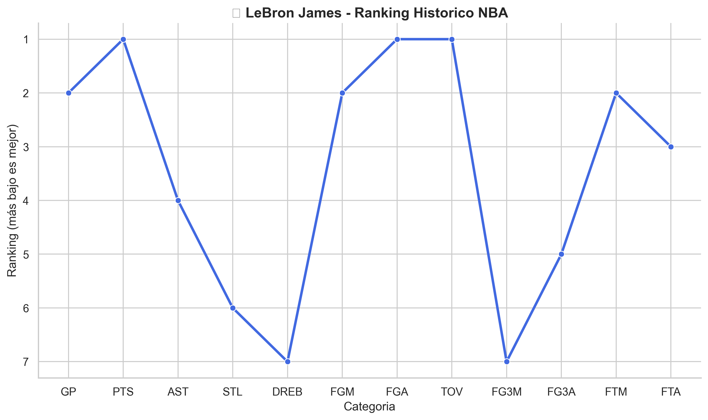

```markdown
# 🏀 NBA Stats Analyzer — LeBron James & League Insights

Este proyecto utiliza la librería [`nba_api`](https://github.com/swar/nba_api) para obtener datos en tiempo real y estadísticas históricas de la NBA.  
El script genera **dataframes** y **gráficos automatizados** que analizan el rendimiento de LeBron James, los líderes actuales de la liga y comparaciones históricas.

---

## 📂 Estructura del Proyecto

```

NBA_Stats_Analyzer/
main.py                # Script principal — descarga, procesa y genera gráficos
utils.py               # Funciones auxiliares (guardar gráficos, correlaciones, etc.)

data/               # Se guarda toda la data descargada (CSV)
Lideres_historicos_ordenado.csv
Lideres_de_la_liga.csv

images/             # Contiene los gráficos generados (PNG)
top10_fg_pct.png
top10_ast.png
lebron_ranking_historico_NBA.png
...

README.md              # Este archivo

````

---

## 📊 Gráficos Generados

| #  | Gráfico                            | Descripción                                                                        |

| 1  | `top10_fg_pct.png`                 | Jugadores con mejor porcentaje de campo (FG%)                                      |
| 2  | `top10_fg3_pct.png`                | Jugadores con mejor porcentaje de triples (FG3%)                                   |
| 3  | `top10_ast.png`                    | Top 10 en asistencias totales (LeBron y Jokic destacados)                          |
| 4  | `top10_reb.png`                    | Top 10 en rebotes totales                                                          |
| 5  | `lebron_puntos_por_temporada.png`  | Evolución de puntos por temporada de LeBron                                        |
| 6  | `lebron_vs_otros_PTS.png`          | Comparativa histórica de puntos totales                                            |
| 7  | `lebron_vs_otros_AST.png`          | Comparativa histórica de asistencias                                               |
| 8  | `lebron_vs_otros_STL.png`          | Comparativa histórica de robos                                                     |
| 9  | `lebron_ranking_historico_NBA.png` | Ranking histórico de LeBron por categoría (invertido: 1° arriba)                   |
| 10 | `activos_vs_retirados_pie.png`     | Porcentaje de jugadores activos vs retirados                                       |
| 11 | `lebron_vs_mechanicos.png`         | Correlación humorística entre tiros de LeBron y mecánicos en Carolina del Norte 😄 |

---

## 📈 Datos Guardados

* **`Lideres_historicos_ordenado.csv`** → contiene todos los líderes históricos por categoría (PTS, AST, REB, etc.).
* **`Lideres_de_la_liga.csv`** → muestra los líderes actuales de la temporada 2024-25.

---

## 🧩 Utilidades

El archivo `utils.py` incluye:

* `calculate_correlation()` → calcula correlación de Pearson, R² y p-value.
* `save_and_show(filename)` → guarda cada gráfico automáticamente en la carpeta **images/** y lo muestra en pantalla.

---

## 🏀 Ejemplo de Salida

**Ranking histórico de LeBron James:**

```
   CATEGORY   RANK
0  PTS        1
1  AST        4
2  STL        6
3  REB        7
...
```

**Gráfico correspondiente:**


---

## 🧠 Créditos

* Datos obtenidos mediante [`nba_api`](https://github.com/swar/nba_api)
* Visualizaciones con `matplotlib` y `seaborn`
* Proyecto desarrollado por *[Iker Hernaez / https://github.com/Ikkotz/Data]*
  💡 Inspirado por el rendimiento legendario de **LeBron James**

---

## 📜 Licencia

Este proyecto se distribuye bajo la licencia **MIT**.
Eres libre de usarlo, modificarlo y compartirlo con atribución.

---